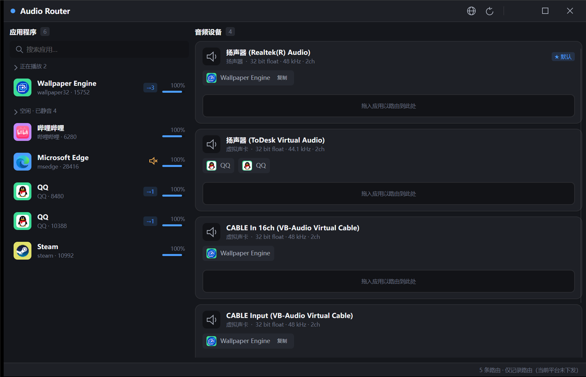

# Audio Router

> English | [简体中文](README.zh-CN.md)

Route one program's audio to a different output device — a modernized fork of
[audiorouterdev/audio-router](https://github.com/audiorouterdev/audio-router).



## Why I made this

It started with a game night. I was playing music for my friends in-game to keep the mood going, and I
was using Soundpad — which is fine for sound effects, but it only plays local audio files, so putting
on actual music was a hassle.

Then I found [audiorouterdev/audio-router](https://github.com/audiorouterdev/audio-router) and was glad
it existed, but it wasn't quite convenient enough for what I wanted. So I took it as the base and
vibe-coded this version on top of it, mainly to make things easier for me and my friends.

If it happens to help you too, that's great. And if it turns out useful, don't forget to give the
original project a star — this wouldn't exist without it.

## Use it

1. Download the **Windows x64** package from [Releases](../../releases)
   (Linux: `linux-x64` / `linux-arm64` / `linux-musl-x64`. macOS is not supported.)
2. Unzip and run **`AudioRouter.Desktop.exe`** — self-contained, no .NET install needed.
3. Drag a program from the left onto a device on the right.

**The one thing to know:** a program has to (re)create its audio stream after being routed. If it is
already playing, **restart it** — that is when the routing takes effect.

The zip also contains `先看这里-怎么用.txt` with these steps and the usual traps
(including how to get past the SmartScreen prompt on a downloaded zip).

## What works

| | Windows x64 | Linux | macOS |
| --- | --- | --- | --- |
| List devices, programs, volume, mute | ✅ | ✅ code complete | — |
| **Redirect one program's audio** | ✅ | ⚠️ not verified on real hardware | ❌ |
| Duplicate to several devices | ✅ (route first, then duplicate) | ❌ | ❌ |
| Saved routings, reapplied automatically | ✅ | ✅ | ✅ |
| Dark UI, drag & drop, English / 中文 | ✅ | ✅ | ✅ |
| Headless CLI | ✅ | ✅ | ✅ |

- The Windows x64 package includes the native core it needs. The **ARM64** package does not: upstream
  only ships x86/x64 tools, so redirection is unavailable there.
- Routing a program that runs elevated needs Audio Router itself to run as administrator.
- Nothing is fabricated — when something is unavailable, the app says so.

## Command line (optional)

```text
audio-router doctor                      can this machine redirect?
audio-router devices                     output devices
audio-router apps                        programs playing audio
audio-router route <pid> <deviceId>      route (restart the app to take effect)
audio-router unroute <pid> <deviceId>
audio-router routes                      saved routings
audio-router apply                       reapply saved routings now
audio-router mute <pid> [--off]
audio-router lang [list|set|import]
```

`--json` for scripts, `--lang <code>` to change the output language. Exit codes: `0` ok, `1` error,
`2` usage.

## Build from source

```powershell
dotnet build AudioRouter.Managed.slnx
dotnet run   --project AudioRouter.Tests     # 138 assertions
```

## License

**GPL-3.0**, inherited from the original project. As a modified version this work must stay GPL-3.0
and cannot be relicensed. Attribution and the modification statement are in [`NOTICE.md`](NOTICE.md).
