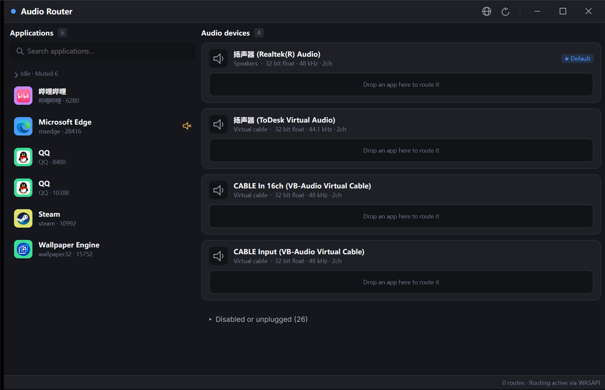

# Audio Router

> English | [简体中文](README.zh-CN.md)

Route one program's audio to a different output device — a modernized fork of
[audiorouterdev/audio-router](https://github.com/audiorouterdev/audio-router).



## Why I made this

It started with a game night. I was playing music for my friends in-game to keep the mood going, and I
was using Soundpad — which is fine for sound effects, but it only plays local audio files, so putting
on actual music was a hassle.

Then I found [audiorouterdev/audio-router](https://github.com/audiorouterdev/audio-router) and was glad
it existed, but it wasn't quite convenient enough for what I wanted. So I took it as the base and
vibe-coded this version on top of it, mainly to make things easier for me and my friends.

If it happens to help you too, that's great. And if it turns out useful, don't forget to give the
original project a star — this wouldn't exist without it.

## Use it

1. Download the **Windows x64** package from [Releases](../../releases)
   (Linux: `linux-x64` / `linux-arm64` / `linux-musl-x64`. macOS is not supported.)
2. Unzip and run **`AudioRouter.Desktop.exe`** — self-contained, no .NET install needed.
3. Drag a program from the left onto a device on the right.

**The one thing to know:** a program has to (re)create its audio stream after being routed. If it is
already playing, **restart it** — that is when the routing takes effect.

The zip also contains `readme.txt` with these steps and the usual traps
(including how to get past the SmartScreen prompt on a downloaded zip).

Closing the program puts the audio back where it was; your saved routes are kept and re-applied next time.

## Using it as a microphone (the usual goal)

Routing to another **speaker** needs nothing extra. What most people actually want, though, is to let
*another program* — Discord, OBS, a game, a voice chat — receive one program's audio **as if it were a
microphone**. Windows has no user-mode way to create a recording device, so this needs a **virtual audio
cable**: a small driver that Windows shows as both a playback device and a recording device.

### 1. Install a cable

[VB-CABLE](https://vb-audio.com/Cable/) (free) is the usual choice; VoiceMeeter bundles one as well.
After installing (the installer may ask you to reboot) you get two extra devices:

| Device | Windows sees it as | Who uses it |
| --- | --- | --- |
| `CABLE Input (VB-Audio Virtual Cable)` | playback device | Audio Router sends the audio **into** it |
| `CABLE Output (VB-Audio Virtual Cable)` | recording device | the other program **records from** it |

### 2. Route the program into the cable

In Audio Router, drag the program that plays the audio onto **`CABLE Input`**.

### 3. Point the other program at the cable

In Discord / OBS / the game, set its **microphone / input device** to **`CABLE Output`**.
Some programs follow the Windows default recording device instead — then set that one under
*Settings → System → Sound → Input*.

### 4. Restart the routed program if it was already playing

The routing takes effect when a program opens its audio stream, so a program that is already playing has
to be restarted first (see the note in *Use it*).

Now the other side hears the music, and nobody else does.

### Want to hear it yourself as well?

Drop the same program onto your speakers too. **A program that already has a route becomes a duplicate
when dropped again**, so it plays on the cable *and* on the speakers:

```text
audio-router route <pid> <cableId>                # into the cable
audio-router route <pid> <speakerId> --duplicate  # and to your speakers
```

### If something does not work

| Symptom | What to check |
| --- | --- |
| The other program hears silence | its input is not `CABLE Output`; or the routed program was never restarted |
| Nobody hears anything, not even you | the audio went only into the cable — see *Want to hear it yourself as well?* |
| The cable devices do not appear in the list | the driver is not installed, or a reboot is still pending |
| A program loses its routing while Audio Router is closed | nothing can be applied while the app is not running - start Audio Router again (it re-applies saved routings automatically), or run `audio-router apply` |
## Do not route a game that runs anti-cheat

This program works by **injecting a DLL into whatever you route**. Doing that to a game with anti-cheat
(CS2/VAC, and most competitive online games) is precisely the kind of tampering those systems are built
to detect - and a ban is permanent. Nobody can promise you otherwise, so do not test it.

**Route the music player, not the game.** The game keeps playing on its normal device, its process is
never touched, and you still get what you wanted: music in one place, game sound in another.
If you want to change the game's own output, use the game's audio settings or the Windows volume mixer -
neither of those injects anything.

Changed your mind and a game was routed by mistake? Just close the game: the DLL goes away with its process.
## What works

| | Windows x64 | Linux | macOS |
| --- | --- | --- | --- |
| List devices, programs, volume, mute | ✅ | ✅ code complete | — |
| **Redirect one program's audio** | ✅ | ⚠️ not verified on real hardware | ❌ |
| Duplicate to several devices | ✅ (route first, then duplicate) | ❌ | ❌ |
| Saved routings, reapplied automatically | ✅ | ✅ | ✅ |
| Dark UI, drag & drop, English / 中文 | ✅ | ✅ | ✅ |
| Headless CLI | ✅ | ✅ | ✅ |

- The Windows x64 package includes the native core it needs. The **ARM64** package does not: upstream
  only ships x86/x64 tools, so redirection is unavailable there.
- Routing a program that runs elevated needs Audio Router itself to run as administrator.
- Nothing is fabricated — when something is unavailable, the app says so.

## Languages

The interface ships in **English** and **简体中文**. Switch any time from the 🌐 button in the top-right
corner — the same menu has **Open language folder**.

Language packs are plain JSON. Drop one into that folder and it appears in the list, no rebuild needed:

```json
{
  "code": "ja-JP",
  "name": "日本語",
  "version": 1,
  "author": "your name",
  "strings": {
    "section.apps": "アプリケーション",
    "device.kind.virtual": "仮想ケーブル"
  }
}
```

The easiest way to write one: copy [`AudioRouter.Core/Languages/en-US.json`](AudioRouter.Core/Languages/en-US.json)
and translate the values — that file lists every key (`code`, `name`, `version`, `author` and `strings`
are the only required fields).

From the CLI: `audio-router lang list` · `audio-router lang set ja-JP` · `audio-router lang import <file>`.
## Command line (optional)

```text
audio-router doctor                      can this machine redirect?
audio-router devices                     output devices
audio-router apps                        programs playing audio
audio-router route <pid> <deviceId>      route (restart the app to take effect)
audio-router unroute <pid> <deviceId>
audio-router routes                      saved routings
audio-router apply                       reapply saved routings now
audio-router mute <pid> [--off]
audio-router lang [list|set|import]
```

`--json` for scripts, `--lang <code>` to change the output language. Exit codes: `0` ok, `1` error,
`2` usage.

## Build from source

```powershell
dotnet build AudioRouter.Managed.slnx
dotnet run   --project AudioRouter.Tests     # 138 assertions
```

## License

**GPL-3.0**, inherited from the original project. As a modified version this work must stay GPL-3.0
and cannot be relicensed. Attribution and the modification statement are in [`NOTICE.md`](NOTICE.md).
