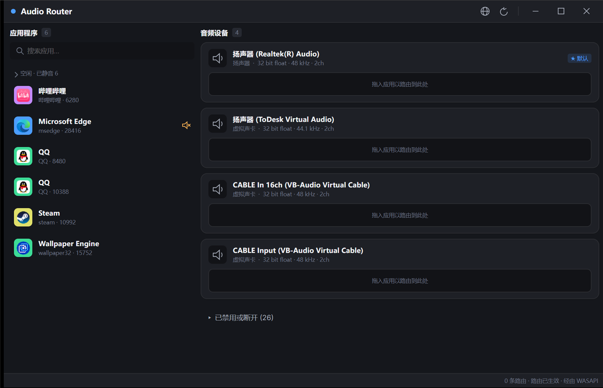

# Audio Router · 音频路由器

> [English](README.md) | 简体中文

把某个程序的音频**单独送到指定输出设备** —— 基于
[audiorouterdev/audio-router](https://github.com/audiorouterdev/audio-router) 的现代化改造版。



## 为什么做这个

起因是和朋友一起玩游戏。我一开始是为了在游戏里给朋友们放点音乐、活跃活跃气氛。
当时用的是 Soundpad —— 放放音效还行，但它只能播放本地音频文件，想放点音乐就比较麻烦。

后来了解到 [audiorouterdev/audio-router](https://github.com/audiorouterdev/audio-router)
这个项目，我很高兴，但用起来还不够方便。于是我以它为基础 vibe coding 了现在这个版本，
主要是想让我和朋友用起来更省事。

如果能帮到你，那就最好了。要是觉得有用，别忘了给原项目一个 star —— 没有它就没有这个项目。

## 怎么用

1. 从 [Releases](../../releases) 下载 **Windows x64** 那个包
   （Linux 用 `linux-x64` / `linux-arm64` / `linux-musl-x64`；macOS 不支持）
2. 解压，双击 **`AudioRouter.Desktop.exe`** —— 自包含，不需要装 .NET
3. 把左边的应用拖到右边的音频设备上

**唯一需要记住的一件事**：应用要在被路由之后**重新创建音频流**才生效。
如果它已经在播放，**重启它** —— 重启后才真正换设备。

压缩包里还有 `readme.txt`，写了这三步和最常踩的坑
（包括下载的 zip 被 Windows SmartScreen 拦了怎么过）。

## 用它当麦克风（多数人的真实目的）

路由到**另一个音箱**本身就能用。但多数人真正想做的，是让**另一个程序** —— Discord、OBS、游戏、
语音软件 —— 把某个程序的音频**当成麦克风**收进去。Windows 没有用户态办法"造出一个录音设备"，
所以这需要一块**虚拟声卡**：一块被系统同时当成播放设备和录音设备的小驱动。

### 1. 装一块虚拟声卡

常用的是 [VB-CABLE](https://vb-audio.com/Cable/)（免费）；VoiceMeeter 也自带一块。
装好（安装程序可能会要求重启）之后你会多出两个设备：

| 设备 | 系统把它当成 | 谁来用它 |
| --- | --- | --- |
| `CABLE Input (VB-Audio Virtual Cable)` | 播放设备 | Audio Router 把音频**送进去** |
| `CABLE Output (VB-Audio Virtual Cable)` | 录音设备 | 另一个程序**从这里录** |

### 2. 把程序路由进这块声卡

在 Audio Router 里，把播放音乐的那个程序拖到 **`CABLE Input`** 上。

### 3. 让另一个程序去接这块声卡

在 Discord / OBS / 游戏里，把它自己的**麦克风 / 输入设备**设成 **`CABLE Output`**。
有些程序是跟随系统默认录音设备的 —— 那就去
*设置 → 系统 → 声音 → 输入* 把默认设备设成 `CABLE Output`。

### 4. 那个程序本来就在播放的话，先重启它

路由要在程序**打开音频流**时才生效，所以已经在播的程序必须先重启（见上面「怎么用」里的那条说明）。

这样别的程序能听到音乐，而旁人听不到。

### 想自己也同时听到？

把同一个程序**再拖到你的扬声器上**：**已经有路由的程序再被拖一次就是复制**，
于是它同时从声卡和扬声器出声：

```text
audio-router route <pid> <声卡ID>              # 送进虚拟声卡
audio-router route <pid> <扬声器ID> --duplicate  # 同时也送到扬声器
```

### 遇到问题怎么查

| 现象 | 该检查什么 |
| --- | --- |
| 另一个程序听到的是静音 | 它的输入不是 `CABLE Output`；或者被路由的程序一直没重启过 |
| 谁都听不到，连你自己也听不到 | 音频只进了虚拟声卡 —— 见上面「想自己也同时听到？」 |
| 设备列表里找不到那两个声卡 | 驱动没装上，或者还差一次重启 |
| Audio Router 关着的时候不生效 | 程序没运行就没人下发 —— 重新打开 Audio Router（它会自动重新套用已保存的路由），或执行 `audio-router apply` |
## 什么能用

| | Windows x64 | Linux | macOS |
| --- | --- | --- | --- |
| 设备 / 程序 / 音量 / 静音 | ✅ | ✅ 代码完成 | — |
| **把某程序音频改道到指定设备** | ✅ | ⚠️ 未在真机验证 | ❌ |
| 复制到多个设备 | ✅（先改道、再复制追加）| ❌ | ❌ |
| 保存路由并在应用出现时自动套用 | ✅ | ✅ | ✅ |
| 深色界面、拖拽、中英文 | ✅ | ✅ | ✅ |
| 无头命令行 | ✅ | ✅ | ✅ |

- Windows x64 包**自带**它需要的原生核心；**ARM64** 包不带（上游只有 x86/x64 工具，ARM64 无法改道）。
- 要路由**以管理员身份运行**的程序，本程序也要用管理员身份运行。
- 不编造数据 —— 拿不到就如实说。

## 语言

界面内置 **English** 与 **简体中文**。随时点右上角的 🌐 按钮切换 —— 同一个菜单里还有**打开语言文件夹**。

语言包就是普通 JSON。丢一个到那个文件夹里，它就会出现在语言列表里，不需要重新编译：

```json
{
  "code": "ja-JP",
  "name": "日本語",
  "version": 1,
  "author": "你的名字",
  "strings": {
    "section.apps": "アプリケーション",
    "device.kind.virtual": "仮想ケーブル"
  }
}
```

最省事的做法：把 [`AudioRouter.Core/Languages/en-US.json`](AudioRouter.Core/Languages/en-US.json)
复制一份，把值翻译掉 —— 那个文件里有全部键名（必填字段只有 `code`、`name`、`version`、`author`、`strings`）。

命令行也可以：`audio-router lang list` · `audio-router lang set ja-JP` · `audio-router lang import <文件>`。
## 命令行（可选）

```text
audio-router doctor                      这台机器能不能改道
audio-router devices                     输出设备
audio-router apps                        正在发声的程序
audio-router route <pid> <deviceId>      路由（重启该应用后生效）
audio-router unroute <pid> <deviceId>
audio-router routes                      已保存的路由
audio-router apply                       立刻重新套用已保存的路由
audio-router mute <pid> [--off]
audio-router lang [list|set|import]
```

`--json` 便于脚本，`--lang <code>` 切换输出语言。退出码：`0` 成功 / `1` 错误 / `2` 用法错误。

## 从源码构建

```powershell
dotnet build AudioRouter.Managed.slnx
dotnet run   --project AudioRouter.Tests     # 138 条断言
```

## 许可

**GPL-3.0**，继承自原项目。作为修改版，本作品必须继续以 GPL-3.0 发布，不能改用其他许可。
来源与修改声明见 [`NOTICE.md`](NOTICE.md)。
